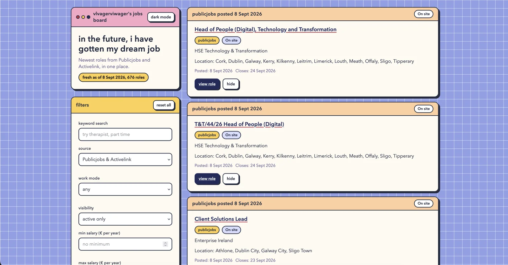

# Aesthetic Job Board

A front facing job board that pulls in roles I care about in an aesthetic pastel UI. It aggregates Irish Publicjobs and Activelink listings, always shows the most recently posted jobs first, and lets me hide roles, filter by hidden state, filter by location, search by keyword, and filter by remote, hybrid, or on site work mode.



This was created for personal use. 

**License:** PolyForm Noncommercial 1.0.0: see [LICENSE](LICENSE). Commercial use requires separate license.

## How to run locally

1. Install dependencies:
```bash
bun install
```
2. Fetch fresh listings:
```bash
bun run jobs:fetch
```
3. Start the dev server:

```bash
bun run dev
```

(Tip: `bun run dev:fetch` runs steps 2 and 3 in one command.)
4. Open the URL shown in the terminal, usually [http://localhost:5192](http://localhost:5192)
5. Build for production:

```bash
bun run build && bun run preview
```

Requires Bun 1.0 or newer. Tested in Firefox with support for other modern browsers.

## Job sources

Two configured sources in `config/sources.json`: Publicjobs (`publicjobs.tal.net` job board) and Activelink (`activelink.ie` vacancies), plus RoomPriceGenie (`roompricegenie.com/careers`). No public JSON APIs were found for either Irish board, so `scripts/fetch-jobs.ts` parses the server rendered HTML list pages at build time (Oleeo Solr HTML for Publicjobs, Drupal teasers for Activelink). RoomPriceGenie is Ashby-hosted and read from the public Ashby posting API. Everything is written to `public/data/jobs.json` sorted newest first.

Shared hidden roles live in `config/hidden.json`. To hide a role for everyone, find its id in `public/data/jobs.json` (for example `publicjobs-8486` or `activelink-127885`), then run `bun run jobs:hide -- --id <job-id>` and commit the updated config. Run with `--unhide` to remove it. The command validates the id against the latest fetched listings and refuses unknown ids. A daily GitHub Actions workflow refetches listings, typechecks, builds, and commits updated data.

Board URLs live in `config/sources.json`, which `scripts/fetch-jobs.ts` reads at runtime. Note the Publicjobs URL contains a session-style token that rotates every few days. If `bun run jobs:fetch` fails with "returned no listings on the first page", open the Publicjobs job board in a browser, copy the fresh listing URL, and update the `publicjobs` entry in `config/sources.json`. The fetch also refuses to overwrite `public/data/jobs.json` when fewer than 50 roles come back, so a broken scrape can never publish an empty board.

## Using the board

* The header shows when listings were last generated and how many roles were pulled in.
* The filters panel has keyword search across title, organisation, summary, and location.
* Location chips include Irish counties plus remote, hybrid, and nationwide style values, with Dublin, Wicklow, and Remote selected by default. Clearing all locations shows every location. Note roles with a bare location like "Other" or "Ireland" are hidden until you clear the defaults or add more locations.
* Source chips toggle Publicjobs, Activelink, and RoomPriceGenie in any combination. Clearing all sources shows every source. Work mode and visibility selects narrow to remote or hybrid or on site, and active only or active plus hidden or hidden only.
* Min and max salary inputs filter by annual € equivalent. Hourly rates are annualised to full time (×2080 hours) and ranges match on overlap, so a €36–43K role still matches a €40K minimum. Roles with no parseable figure are hidden while a salary bound is set.
* Each role card links out to the original posting and has a hide or unhide button. Hides apply instantly in the browser and persist in localStorage on top of the shared `config/hidden.json` base.
* Salary is shown on the card when the advertiser publishes it. Activelink detail pages often include it; Publicjobs list and detail pages do not, so those cards show no salary line.
* The theme toggle switches light and dark mode and respects the system preference on first load.

## Useful scripts

* `bun run dev` - start the dev server
* `bun run dev:fetch` - fetch fresh listings, then start the dev server
* `bun run jobs:fetch` - fetch both boards and write `public/data/jobs.json`
* `bun run jobs:hide -- --id <job-id>` - hide a role in `config/hidden.json`, add `--unhide` to remove, use `--list` to show all hidden ids
* `bun run test` - run unit tests
* `bun run build` - fetch jobs and build for production
* `bun run build:offline` - build for production without fetching
* `bun run preview` - preview the production build
* `bun run typecheck` - run `tsc --noEmit`

## Tech stack

* TypeScript
* Vite
* Bun for scripts and package management
* Vanilla DOM and CSS with no framework
* Cheerio for build time HTML parsing
